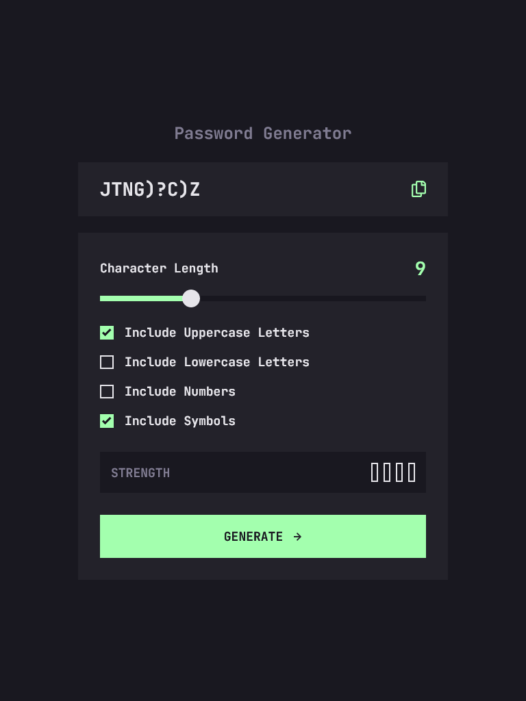

# HTTA Code Challenge - Password generator app solution

This is a solution to the [Password generator app challenge on Hertechtrail Code Challenge](https://github.com/ESTHER-OLA/password-generator-app). Hertechtrail Code challenges help you improve your coding skills by building realistic projects during the course of your learning in the cohorts.

## Table of contents

- [HTTA Code Challenge - Password generator app solution](#htta-code-challenge---password-generator-app-solution)
  - [Table of contents](#table-of-contents)
  - [Overview](#overview)
    - [The challenge](#the-challenge)
    - [Screenshot](#screenshot)
      - [Mobile View :](#mobile-view-)
      - [Tablet View :](#tablet-view-)
      - [Desktop View :](#desktop-view-)
    - [Links](#links)
  - [My process](#my-process)
    - [Built with](#built-with)
    - [What I learned](#what-i-learned)
    - [Bugs](#bugs)
    - [Useful resources](#useful-resources)
  - [Author](#author)
  - [Acknowledgments](#acknowledgments)


## Overview

### The challenge

Users should be able to:

- Generate a password based on the selected inclusion options
- Copy the generated password to the computer's clipboard
- See a strength rating for their generated password
- View the optimal layout for the interface depending on their device's screen size
- See hover and focus states for all interactive elements on the page

### Screenshot


#### Mobile View :


#### Tablet View :



#### Desktop View :


### Links

- [Solution URL](https://passwordgench.netlify.app/)
- [Live Site URL](https://github.com/ESTHER-OLA/passwordgen-app)

## My process

### Built with

- Semantic HTML5 markup
- CSS custom properties
- Flexbox
- CSS Grid
- Vanilla JS
- ZXCVBN Library

### What I learned

- If a flex item dont grow, add flex:1 property to make it do so
- margin: auto can achieve sometimes the wanted layout faster than using flexbox or grid
- How to copy a text to clipboard using Javascript

```js
try {
    await navigator.clipboard.writeText(what.to.copy);
  } catch(err) {
    console.error('Failed to copy: ', err);
  }
}
```

- How to customize a range input
- How to customize a checkbox input

### Bugs

- When checked, If the user hovers over the checkbox , the cursor doesn't switch to pointer and the click doesn't uncheck the case


### Useful resources

- [Password generator algorithm](https://x-engineer.org/random-password-generator-algorithm/) - I used this algorithm to generate the wanted passwords
- [Slider styler](https://toughengineer.github.io/demo/slider-styler/slider-styler.html) - This helped to get the slider done in a short time without the need to care about the browsers issue


## Author


- LinkedIn - [@ola-esther](www.linkedin.com/in/ola-esther-96255918b/)
- Github - [@Esther-Ola](https://github.com/ESTHER-OLA)


## Acknowledgments

Big thank you to hertechtrail for this opportunity to learn and explore during the course of my learning.
